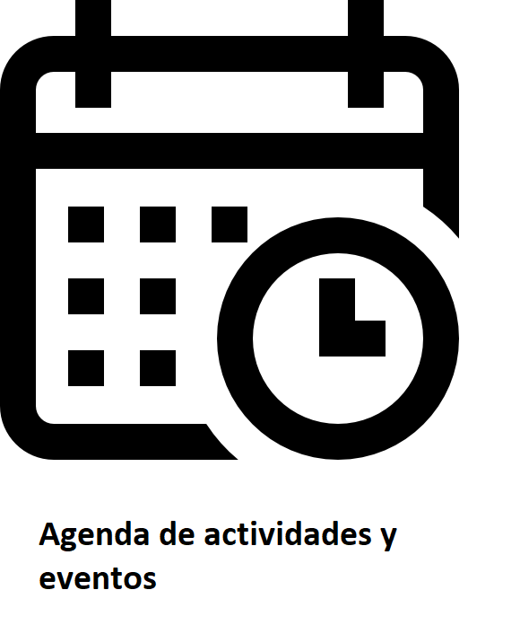
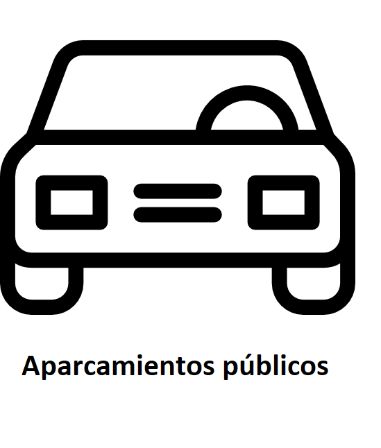
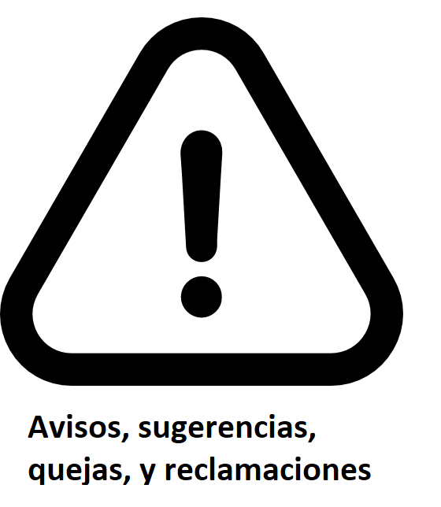
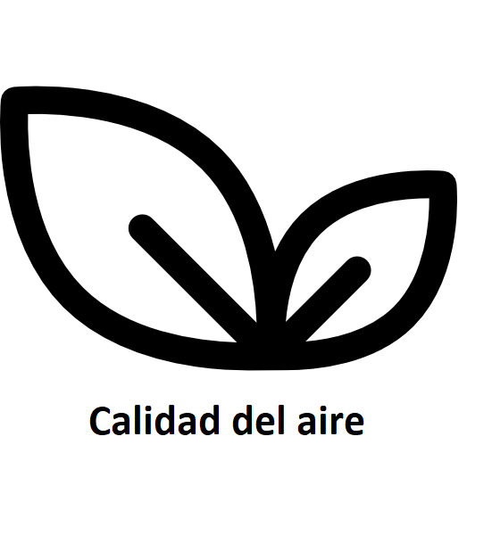
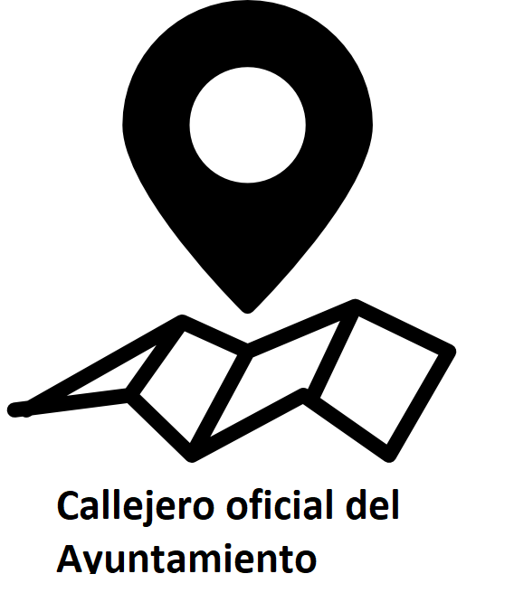
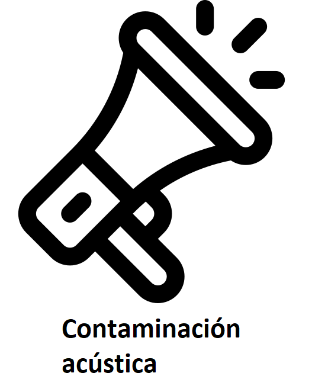
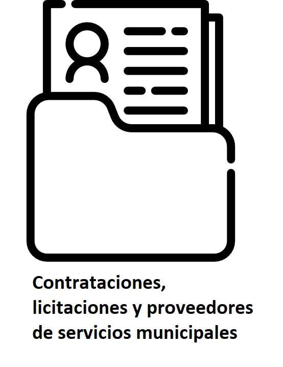
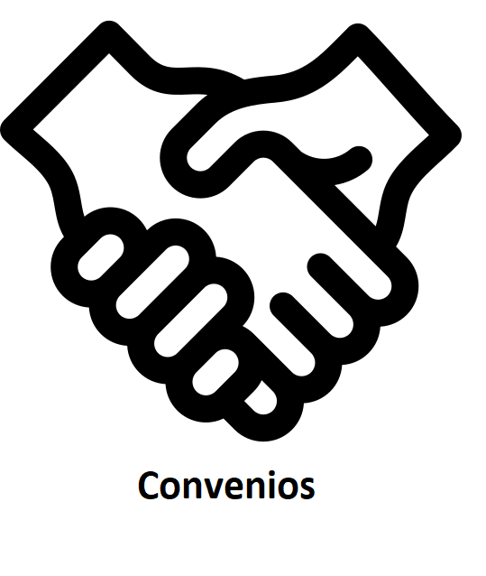
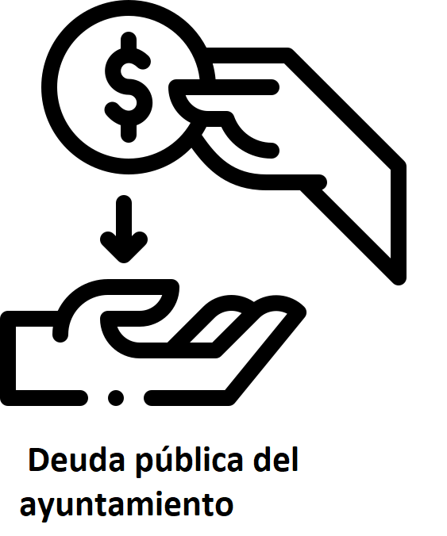

<link href="stylesheet.css" rel="stylesheet"/>

## Bienvenido a los vocabularios
<h1> HOLA </h1>

    &nbsp;&nbsp; 
   &nbsp;&nbsp;
   &nbsp;&nbsp; 
   &nbsp;&nbsp; 

&nbsp; 

    &nbsp;&nbsp; 
    &nbsp;&nbsp; 
    &nbsp;&nbsp; &nbsp;
    &nbsp;&nbsp;

&nbsp; 

    &nbsp;&nbsp; 
    &nbsp;&nbsp; 
    &nbsp;&nbsp; 
    &nbsp;&nbsp; 

&nbsp; 

<table style="width:100%; table-layout:fixed">
<tr>
<th>  Agenda municipal alcaldía y personal directivo </th>
<th> Agenda de actividades y eventos </th>
<th>  Aparcamientos públicos </th>
<th> Avisos, sugerencias, quejas, y reclamaciones </th>
</tr>
<tr>
        <td style="width:50px">
        
        </td>
        <td style="width:50px">
          
        </td>
        <td style="width:50px">
       
        </td>
        <td style="width:50px">
       
        </td>
</tr>
</table>

<table style="width:100%; table-layout:fixed">
<tr>
<th style="width:50px">  Bicileta pública </th>
<th style="width:50px"> Calidad del aire </th>
<th style="width:50px">  Callejero oficial del Ayuntamiento </th>
<th style="width:50px"> Censo de locales, actividades, terrazas de hostelería y restauración y licencias de apertura </th>
</tr>
<tr>
        <td style="width:50px">
        
        </td>
        <td style="width:50px">
          
        </td>
        <td style="width:50px">
       
        </td>
        <td style="width:50px">
       
        </td>
</tr>
</table>

<table style="width:100%; table-layout:fixed">
<tr>
<th style="width:50px">Contaminación acústica(día, tarde, noche, industrial, tráfico rodado) </th>
<th style="width:50px">Contrataciones, licitaciones y proveedores de servicios municipales </th> 
<th style="width:50px">Convenios </th>
<th style="width:50px"> Deuda pública del ayuntamiento </th>
</tr>
<tr>
        <td style="width:50px">
        
        </td>
        <td style="width:50px">
          
        </td>
        <td style="width:50px">
       
        </td>
        <td style="width:50px">
       
        </td>
</tr>
</table>

   

   

