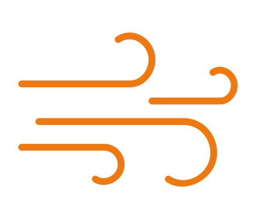
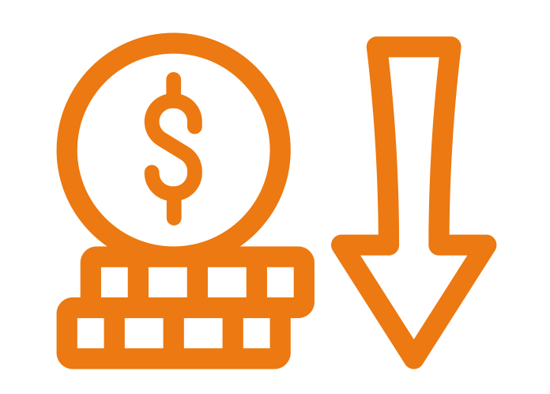

---
# You don't need to edit this file, it's empty on purpose.
# Edit theme's home layout instead if you wanna make some changes
# See: https://jekyllrb.com/docs/themes/#overriding-theme-defaults
layout: splash
title: Vocabularios FEMP
header:
  overlay_color: "#000"
  overlay_filter: "0.5"
  overlay_image: bicicleta.png
excerpt: "Conjunto de datos clasificados segun los criterios de la Federación Española de Municipios y Provincias ."
---
<link href="stylesheet.css" rel="stylesheet"/>
<link href="_data/navigation.yml" rel="external"/>

&nbsp;

  
  
  <figure class="imagen">
  <a href="https://fempcatalogo.github.io/FEMPAGENDA">  
    <figcaption>Agenda municipal alcaldía y personal directivo</figcaption></a>
</figure>    

  <figure class="imagen">
    <a href="https://fempcatalogo.github.io/FEMPAGENDAACTIVIDADES"> 
    <figcaption>Agenda de actividades y eventos</figcaption></a>
</figure>    

  <figure class="imagen">
   <a href="https://fempcatalogo.github.io/FEMPAPARCAIENTOS">
    <figcaption>Aparcamientos públicos</figcaption></a>
</figure>

  <figure class="imagen">
   <a href="https://fempcatalogo.github.io/FEMPAVISOS">
    <figcaption>Avisos, sugerencias, quejas y reclamaciones</figcaption></a>
</figure>

  <figure class="imagen">
   <a href="https://fempcatalogo.github.io/FEMPBICICLETA"> 
    <figcaption>Bicicleta pública</figcaption></a>
</figure>

  <figure class="imagen">
  <a href="https://fempcatalogo.github.io/FEMPCALIDADAIRE">
    <figcaption>Calidad del aire</figcaption></a>
</figure>

  <figure class="imagen">
  <a href="https://fempcatalogo.github.io/FEMPCALLEJERO"> 
    <figcaption>Callejero oficial del Ayuntamiento</figcaption></a>
</figure>

  <figure class="imagen">
  <a href="https://fempcatalogo.github.io/FEMPCENSO"> 
    <figcaption>Censo de locales, actividades, terrazas de hostelería y restauración, y licencias de apertura</figcaption></a>
</figure>

 <figure class="imagen">
 <a href="https://fempcatalogo.github.io/FEMPCONTAMINACION">
    <figcaption>Contaminación acústica</figcaption></a>
</figure>

 <figure class="imagen">
 <a href="https://fempcatalogo.github.io/FEMPCONTRATACIONES">
    <figcaption>Contrataciones, licitaciones y proveedores de servicios municipales</figcaption></a>
</figure>

 <figure class="imagen">
<a href="https://fempcatalogo.github.io/FEMPCONVENIOS"> 
    <figcaption>Convenios</figcaption></a>
</figure>

 <figure class="imagen">
<a href="https://fempcatalogo.github.io/FEMPDEUDAPUBLICA"> 
    <figcaption>Deuda pública del ayuntamiento</figcaption></a>
</figure>

 <figure class="imagen">
<a href="https://fempcatalogo.github.io/FEMPEQUIPAMIENTO">
    <figcaption>Equipamientos municipales</figcaption></a>
</figure>

 <figure class="imagen">
<a href="https://fempcatalogo.github.io/FEMPTRAFICO">
    <figcaption>Tráfico</figcaption></a>
</figure>

 <figure class="imagen">
 <a href="https://fempcatalogo.github.io/FEMPINSTALACIONESDEPORTIVAS"> 
    <figcaption>Instalaciones deportivas</figcaption></a>
</figure>

 <figure class="imagen">
<a href="https://fempcatalogo.github.io/FEMPLUGARINTERE"> 
    <figcaption>Lugar de interés turístico</figcaption></a>
</figure>

 <figure class="imagen">
<a href="https://fempcatalogo.github.io/FEMPPADRONMUNICIPAL">
    <figcaption>Padrón municipal: población</figcaption></a>
</figure>

 <figure class="imagen">
<a href="https://fempcatalogo.github.io/FEMPPRESUPUESTO">
    <figcaption>Presupuesto municipal y ejecución presupuestaria</figcaption></a>
</figure>

 <figure class="imagen">
<a href="https://fempcatalogo.github.io/FEMPPUNTOACCESO"> 
    <figcaption>Puntos de acceso WIFI públicos</figcaption></a>
</figure>

 <figure class="imagen">
<a href="https://fempcatalogo.github.io/FEMPTRANSPORTEPUBLICO"> 
    <figcaption>Transporte público</figcaption></a>
</figure>

<figure class="imagen">
<a href="https://fempcatalogo.github.io/FEMPCARTOGRAFIA">
    <figcaption>Cartografía municipal</figcaption></a>
</figure>

<figure class="imagen">
<a href="https://fempcatalogo.github.io/FEMPACCIDENTES">
    <figcaption>Accidentes de tráfico</figcaption></a>
</figure>

<figure class="imagen">
<a href="https://fempcatalogo.github.io/FEMPCONTENEDORES"> 
    <figcaption>Contenedores para el reciclaje</figcaption></a>
</figure>

<figure class="imagen">
<a href="https://fempcatalogo.github.io/FEMPREGISTRO"> 
    <figcaption>Registro de asociaciones</figcaption></a>
</figure>

<figure class="imagen">
<a href="https://fempcatalogo.github.io/FEMPALOJAMIENTOS">
    <figcaption>Alojamientos, hoteles, alojamientos turísticos y viviendas vacacionales</figcaption></a>
</figure>

<figure class="imagen">
<a href="https://fempcatalogo.github.io/FEMPAGUA">
    <figcaption>Calidad del agua</figcaption></a>
</figure>

<figure class="imagen">
 <a href="https://fempcatalogo.github.io/FEMPCARRILBICI"> 
    <figcaption>Carriles bici/ vías ciclistas/ calles tranquilas</figcaption></a>
</figure>

<figure class="imagen">
 <a href="https://fempcatalogo.github.io/FEMPALUMBRADO"> 
    <figcaption>Alumbrado público</figcaption></a>
</figure>

<figure class="imagen">
<a href="https://fempcatalogo.github.io/FEMPSUBVENCIONES">
    <figcaption>Subvenciones</figcaption></a>
</figure>

<figure class="imagen">
<a href="https://fempcatalogo.github.io/FEMPZONAINFANTIL">
    <figcaption>Zonas infantiles y zonas de mayores</figcaption></a>
</figure>

<figure class="imagen">
 <a href="https://fempcatalogo.github.io/FEMPCENSOEMPRESA">  
    <figcaption>Censo de empresas que pagan impuestos o están obligadas en Entidades Locales</figcaption></a>
</figure>

<figure class="imagen">
<a href="https://fempcatalogo.github.io/FEMPFACTURAS"> 
    <figcaption>Facturas</figcaption></a>
</figure>

<figure class="imagen">
 <a href="https://fempcatalogo.github.io/FEMPCENSOVEHICULOS">
    <figcaption>Censo de vehículos</figcaption></a>
</figure>

<figure class="imagen">
 <a href="https://fempcatalogo.github.io/FEMPINVENTARIO">
    <figcaption>Inventario de bienes urbanos y rústicos</figcaption></a>
</figure>

<figure class="imagen">
 <a href="https://fempcatalogo.github.io/FEMPPARQUES">  
    <figcaption>Parques y jardines</figcaption></a>
</figure>

<figure class="imagen">
 <a href="https://fempcatalogo.github.io/FEMPRPT"> 
    <figcaption>Relación de Puestos de Trabajo(RPT)</figcaption></a>
</figure>

<figure class="imagen">
 <a href="https://fempcatalogo.github.io/FEMPLICENCIAS">
    <figcaption>Licencias urbanísticas y de actividad de locales comerciales</figcaption></a>
</figure>

<figure class="imagen">
 <a href="https://fempcatalogo.github.io/FEMPRESIDUOS">
    <figcaption>Gestión de residuos</figcaption></a>
</figure>

<figure class="imagen">
 <a href="https://fempcatalogo.github.io/FEMPFUENTES"> 
    <figcaption>Fuente de agua de beber</figcaption></a>
</figure>

<figure class="imagen">
 <a href="https://fempcatalogo.github.io/FEMPSANCIONES"> 
    <figcaption>Sanciones y multas</figcaption></a>
</figure>

<figure class="imagen">
<a href="https://fempcatalogo.github.io/FEMPOTROS"> 
    <figcaption>OTROS</figcaption></a>
</figure>

                                                                                          

<!--

    &nbsp;&nbsp; &nbsp;&nbsp;&nbsp;
   &nbsp;&nbsp; &nbsp;&nbsp;&nbsp;
   &nbsp;&nbsp; &nbsp;&nbsp;&nbsp;
    &nbsp; &nbsp; 

    &nbsp;&nbsp; &nbsp; &nbsp;&nbsp;&nbsp;
    &nbsp;&nbsp; &nbsp;&nbsp;&nbsp;
       &nbsp;&nbsp; &nbsp; &nbsp;&nbsp;&nbsp;
    &nbsp;&nbsp;

    &nbsp;&nbsp; &nbsp;&nbsp;&nbsp;
    &nbsp;&nbsp; &nbsp;&nbsp;&nbsp;
    &nbsp;&nbsp;   &nbsp;&nbsp;&nbsp;
    &nbsp;&nbsp;   

    &nbsp;&nbsp;  &nbsp;&nbsp;&nbsp;
    &nbsp;&nbsp;  &nbsp;&nbsp;&nbsp;
    &nbsp;&nbsp; &nbsp;&nbsp;&nbsp;
    &nbsp;&nbsp; 

    &nbsp;&nbsp; &nbsp;&nbsp;&nbsp;
    &nbsp;&nbsp; &nbsp;&nbsp;&nbsp;
    &nbsp;&nbsp;  &nbsp;&nbsp;&nbsp;
    &nbsp;&nbsp; 

    &nbsp;&nbsp;  &nbsp;&nbsp;&nbsp;
    &nbsp;&nbsp;  &nbsp;&nbsp;&nbsp;
    &nbsp;&nbsp;  &nbsp;&nbsp;&nbsp;
    &nbsp;&nbsp; 

    &nbsp;&nbsp;  &nbsp;&nbsp;&nbsp;
    &nbsp;&nbsp;  &nbsp;&nbsp;&nbsp;
    &nbsp;&nbsp;  &nbsp;&nbsp;&nbsp;
    &nbsp;&nbsp; 

    &nbsp;&nbsp;  &nbsp;&nbsp;&nbsp;
    &nbsp;&nbsp;  &nbsp;&nbsp;&nbsp;
    &nbsp;&nbsp;  &nbsp;&nbsp;&nbsp;
    &nbsp;&nbsp; 

    &nbsp;&nbsp;  &nbsp;&nbsp;&nbsp;
    &nbsp;&nbsp;   &nbsp;&nbsp;&nbsp;
    &nbsp;&nbsp;   &nbsp;&nbsp;&nbsp;
    &nbsp;&nbsp; 

    &nbsp;&nbsp;   &nbsp;&nbsp;&nbsp;
    &nbsp;&nbsp;   &nbsp;&nbsp;&nbsp;
    &nbsp;&nbsp;  &nbsp;&nbsp;&nbsp;
    &nbsp;&nbsp; 

   

-->

&nbsp; 

&nbsp; 
