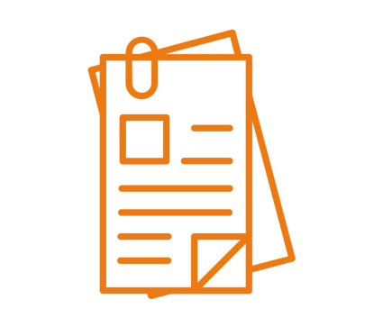

---
# You don't need to edit this file, it's empty on purpose.
# Edit theme's home layout instead if you wanna make some changes
# See: https://jekyllrb.com/docs/themes/#overriding-theme-defaults
layout: splash
classes: wide
---

<link href="stylesheet.css" rel="stylesheet"/>
<link href="_data/navigation.yml" rel="external"/>

&nbsp; 
&nbsp; 

<h1 float="right" align="center">Vocabularios FEMP</h1>

---

&nbsp;

    &nbsp;&nbsp; 
   &nbsp;&nbsp;
   &nbsp;&nbsp; 
    &nbsp; &nbsp; 

    &nbsp;&nbsp; &nbsp; 
    &nbsp;&nbsp; 
       &nbsp;&nbsp; &nbsp;
    &nbsp;&nbsp;

    &nbsp;&nbsp; 
    &nbsp;&nbsp; 
    &nbsp;&nbsp; 
    &nbsp;&nbsp; 

&nbsp; 

&nbsp; 

 

 

   

  

