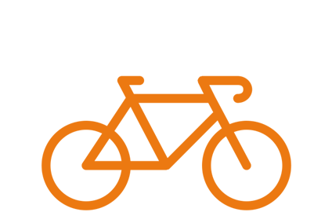
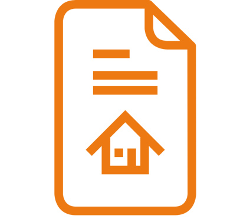
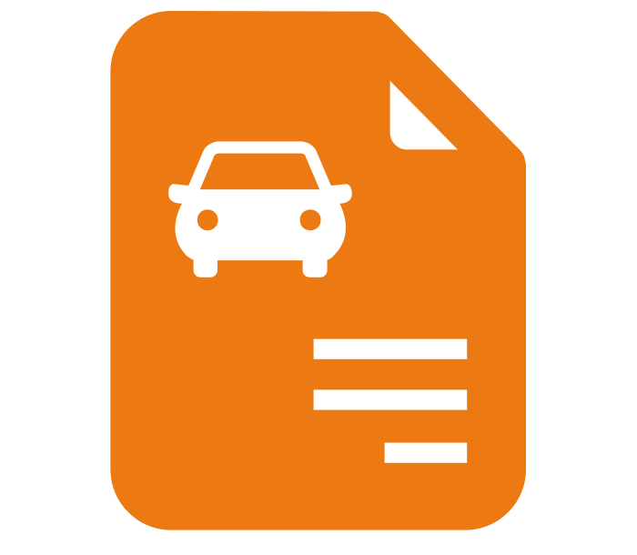

---
# You don't need to edit this file, it's empty on purpose.
# Edit theme's home layout instead if you wanna make some changes
# See: https://jekyllrb.com/docs/themes/#overriding-theme-defaults
layout: splash
title: Vocabularios FEMP
header:
  overlay_color: "#000"
  overlay_filter: "0.5"
  overlay_image: bicicleta.png
excerpt: "Conjunto de datos clasificados segun los criterios de la Federación Española de Municipios y Provincias ."
---

<link href="stylesheet.css" rel="stylesheet"/>
<link href="_data/navigation.yml" rel="external"/>

&nbsp;

    &nbsp;&nbsp; 
   &nbsp;&nbsp;
   &nbsp;&nbsp; 
    &nbsp; &nbsp; 

    &nbsp;&nbsp; &nbsp; 
    &nbsp;&nbsp; 
       &nbsp;&nbsp; &nbsp;
    &nbsp;&nbsp;

    &nbsp;&nbsp; 
    &nbsp;&nbsp; 
    &nbsp;&nbsp; 
    &nbsp;&nbsp; 

    &nbsp;&nbsp; 
    &nbsp;&nbsp; 
    &nbsp;&nbsp; 
    &nbsp;&nbsp; 

    &nbsp;&nbsp; 
    &nbsp;&nbsp; 
    &nbsp;&nbsp; 
    &nbsp;&nbsp; 

    &nbsp;&nbsp; 
    &nbsp;&nbsp; 
    &nbsp;&nbsp; 
    &nbsp;&nbsp; 

    &nbsp;&nbsp; 
    &nbsp;&nbsp; 
    &nbsp;&nbsp; 
    &nbsp;&nbsp; 

    &nbsp;&nbsp; 
    &nbsp;&nbsp; 
    &nbsp;&nbsp; 
    &nbsp;&nbsp; 

    &nbsp;&nbsp; 
    &nbsp;&nbsp; 
    &nbsp;&nbsp; 
    &nbsp;&nbsp; 

    &nbsp;&nbsp; 
    &nbsp;&nbsp; 
    &nbsp;&nbsp; 
    &nbsp;&nbsp; 

&nbsp; 

&nbsp; 

 

 

   

  

