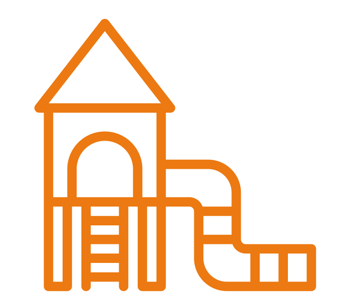

---
# You don't need to edit this file, it's empty on purpose.
# Edit theme's home layout instead if you wanna make some changes
# See: https://jekyllrb.com/docs/themes/#overriding-theme-defaults
layout: splash
title: Vocabularios FEMP
header:
  overlay_color: "#000"
  overlay_filter: "0.5"
  overlay_image: bicicleta.png
excerpt: "Conjunto de datos clasificados segun los criterios de la Federación Española de Municipios y Provincias ."
---

<link href="stylesheet.css" rel="stylesheet"/>
<link href="_data/navigation.yml" rel="external"/>

&nbsp;

  <figure class="imagen">
  
  <figcaption>Agenda Municipal</figcaption>
</figure>
    &nbsp;&nbsp; &nbsp;&nbsp;&nbsp;
   &nbsp;&nbsp; &nbsp;&nbsp;&nbsp;
   &nbsp;&nbsp; &nbsp;&nbsp;&nbsp;
    &nbsp; &nbsp; 

    &nbsp;&nbsp; &nbsp; &nbsp;&nbsp;&nbsp;
    &nbsp;&nbsp; &nbsp;&nbsp;&nbsp;
       &nbsp;&nbsp; &nbsp; &nbsp;&nbsp;&nbsp;
    &nbsp;&nbsp;

    &nbsp;&nbsp; &nbsp;&nbsp;&nbsp;
    &nbsp;&nbsp; &nbsp;&nbsp;&nbsp;
    &nbsp;&nbsp;   &nbsp;&nbsp;&nbsp;
    &nbsp;&nbsp;   

    &nbsp;&nbsp;  &nbsp;&nbsp;&nbsp;
    &nbsp;&nbsp;  &nbsp;&nbsp;&nbsp;
    &nbsp;&nbsp; &nbsp;&nbsp;&nbsp;
    &nbsp;&nbsp; 

    &nbsp;&nbsp; &nbsp;&nbsp;&nbsp;
    &nbsp;&nbsp; &nbsp;&nbsp;&nbsp;
    &nbsp;&nbsp;  &nbsp;&nbsp;&nbsp;
    &nbsp;&nbsp; 

    &nbsp;&nbsp;  &nbsp;&nbsp;&nbsp;
    &nbsp;&nbsp;  &nbsp;&nbsp;&nbsp;
    &nbsp;&nbsp;  &nbsp;&nbsp;&nbsp;
    &nbsp;&nbsp; 

    &nbsp;&nbsp;  &nbsp;&nbsp;&nbsp;
    &nbsp;&nbsp;  &nbsp;&nbsp;&nbsp;
    &nbsp;&nbsp;  &nbsp;&nbsp;&nbsp;
    &nbsp;&nbsp; 

    &nbsp;&nbsp;  &nbsp;&nbsp;&nbsp;
    &nbsp;&nbsp;  &nbsp;&nbsp;&nbsp;
    &nbsp;&nbsp;  &nbsp;&nbsp;&nbsp;
    &nbsp;&nbsp; 

    &nbsp;&nbsp;  &nbsp;&nbsp;&nbsp;
    &nbsp;&nbsp;   &nbsp;&nbsp;&nbsp;
    &nbsp;&nbsp;   &nbsp;&nbsp;&nbsp;
    &nbsp;&nbsp; 

    &nbsp;&nbsp;   &nbsp;&nbsp;&nbsp;
    &nbsp;&nbsp;   &nbsp;&nbsp;&nbsp;
    &nbsp;&nbsp;  &nbsp;&nbsp;&nbsp;
    &nbsp;&nbsp; 

   

&nbsp; 

&nbsp; 
